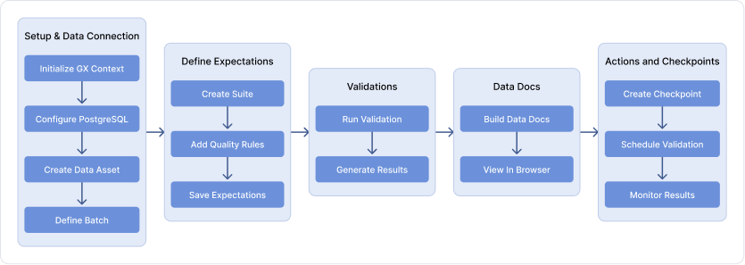

# Great Expectations Demo: NYC Taxi Data Validation
A data validation framework using Great Expectations (GX Core) to ensure data quality for Yellow Taxi trip data.

## About This Repository
This repository is a humble attempt to demonstrate and promote the usage of Great Expectations (GX Core), a powerful open-source data validation framework. While the official documentation comprehensively covers all features, this repository aims to provide a practical, step-by-step example that newcomers can follow easily.

This repository accompanies the blog post ["Data Validation Framework using Great Expectations (GX Core): Ensuring Data Quality at Scale"](#) (link coming soon).

## Author
**Anand Ramkumar**
- LinkedIn: [Anand Ramkumar](https://www.linkedin.com/in/anand-ramkumar-04675a1b2)
- Role: Test Architect at [Experion Technologies](https://experionglobal.com/)
- Experienced Test Architect specializing in AI-driven testing, automation frameworks, and data validation, ensuring high-quality, scalable software solutions.

## Overview
This project demonstrates how to:
- Set up Great Expectations for data validation
- Connect to PostgreSQL data sources
- Define and manage data quality expectations
- Run validations and generate reports
- Automate validation through checkpoints

## Workflow
The following diagram illustrates the complete workflow of data validation using Great Expectations:



This workflow consists of five main stages:
1. **Setup & Data Connection**: Initialize the framework and connect to data sources
2. **Define Expectations**: Create and configure data quality rules
3. **Run Validations**: Execute data validation checks
4. **Data Docs**: Generate and view validation results
5. **Actions and Checkpoints**: Automate and monitor validations

## Development Environment
This repository was developed and tested with:
- Operating System: Windows
- Anaconda Distribution: conda 24.5.0
- Python Version: 3.11.11
- Great Expectations: Core (GX Core) v1.3.7

## Prerequisites
- Windows operating system
- Anaconda Distribution (conda 24.5.0 or higher)
- Python 3.11 or higher
- PostgreSQL database with Yellow Taxi data
- Basic understanding of data validation concepts

## Installation

### 1. Install Anaconda
1. Download Anaconda from [https://www.anaconda.com/download](https://www.anaconda.com/download)
2. Verify installation by opening Anaconda Prompt and running:
   ```bash
   conda --version
   ```

### 2. Create Conda Environment
```bash
conda create -n gxcore-env python=3.11
conda activate gxcore-env
```

### 3. Install Dependencies
```bash
# Install Great Expectations with PostgreSQL support
pip install "great_expectations[postgresql]"  # Required for PostgreSQL database integration

# Install Jupyter support using conda
conda install -n gxcore-env ipykernel --update-deps --force-reinstall
```
*Note: For a full list of additional dependencies, refer to the [Great Expectations documentation](https://docs.greatexpectations.io/docs/core/set_up_a_gx_environment/install_additional_dependencies#installation-sql)*

### 4. Configure PostgreSQL Connection
Ensure your PostgreSQL database is running and accessible with:
- Host: 127.0.0.1
- Port: 5450 (The default port is 5432; however, Port 5450 is used for this test environment.)
- Database: postgres
- Username: postgres
- Password: superpass

## Project Structure
```
.
├── gx/                     # Great Expectations configuration
├── gx_yellowtaxi_data_validation_tutorial.ipynb  # Data validation tutorial
├── run_yellowtaxi_validation_checkpoint.py  # Validation script
└── README.md              # This file
```

## Usage

### 1. Initial Setup
Run through the `yellowtaxi_expectations.ipynb` notebook to:
- Initialize Great Expectations
- Connect to your database
- Define data quality expectations
- Create validation checkpoints

### 2. Running Validations
Execute validations using the provided script:
```bash
conda run -n gxcore-env python run_yellowtaxi_validation_checkpoint.py
```

### 3. View Results
Access validation results in your browser:
```
./gx/uncommitted/data_docs/local_site/index.html
```

## Validation Rules
Current implementation validates:
- `pickup_date` is not null
- `passenger_count` is between 0 and 6

## Contributing
Feel free to extend the validation rules or improve the implementation.

## Further Reading
For a detailed walkthrough and additional insights, check out the accompanying blog post: ["Data Validation Framework using Great Expectations (GX Core): Ensuring Data Quality at Scale"](#) (link coming soon)

## Credits and Acknowledgments
This implementation is entirely based on [Great Expectations](https://greatexpectations.io/), a remarkable open-source framework created by the talented team at Great Expectations. We are deeply grateful to:

- The entire Great Expectations team for creating and maintaining this versatile tool
- The comprehensive [documentation](https://docs.greatexpectations.io/) that makes learning and implementation accessible
- The active community that supports and enhances the framework

*Note: This repository is not officially affiliated with Great Expectations. For the most up-to-date and comprehensive information, please refer to the [official documentation](https://docs.greatexpectations.io/docs/core/introduction/).*
